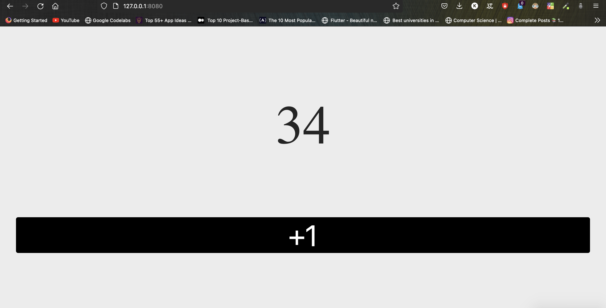

# hello-wasm
An Introduction to Web Assembly

`git clone https://github.com/Mr-Sunglasses/hello-wasm`

`cd hello-wasm`

`cargo install trunk`

`rustup target add wasm32-unknown-unknown`

`trunk serve`

Just Kill JavaScript and Use Rust.
